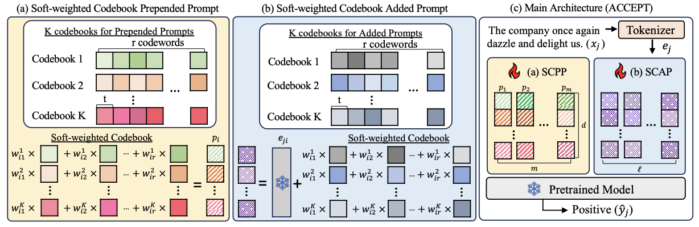
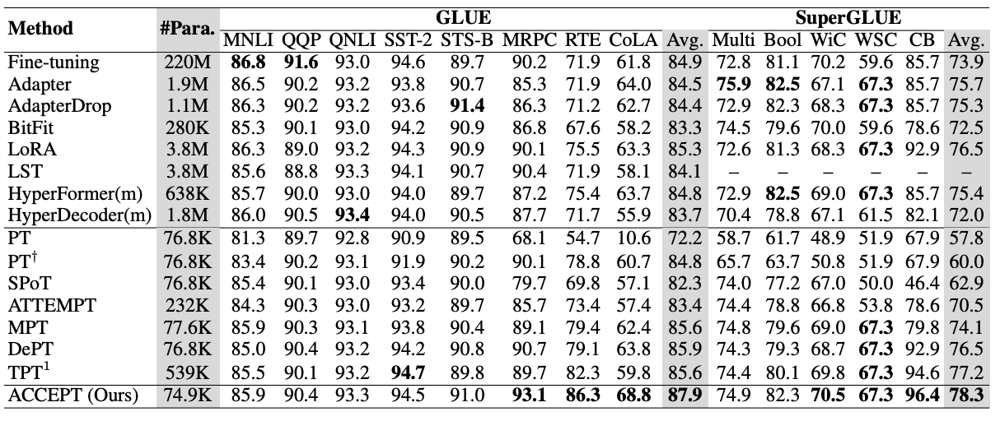

# ACCEPT: Adaptive Codebook for Composite and Efficient Prompt Tuning
[](https://aclanthology.org/2024.findings-emnlp.900/)

Official codebase for the paper, **"ACCEPT: Adaptive Codebook for Composite and Efficient Prompt Tuning"**  

## 🌟 Overview

Prompt Tuning has been a popular Parameter-Efficient Fine-Tuning method attributed to its remarkable performance with few updated parameters on various large-scale pretrained Language Models (PLMs). Traditionally, each prompt has been considered indivisible and updated independently, leading the parameters increase proportionally as prompt length grows. To address this issue, we propose Adaptive Codebook for Composite and Efficient Prompt Tuning (ACCEPT). In our method, we refer to the concept of product quantization (PQ), allowing all soft prompts to share a set of learnable codebook vectors in each subspace, with each prompt differentiated by a set of adaptive weights. We achieve the superior performance on 17 diverse natural language tasks including natural language understanding (NLU) and question answering (QA) tasks by tuning only 0.3% of parameters of the PLMs. Our approach also excels in few-shot and large model settings, highlighting its significant potential.
  <p align="center">


  </p>

<details>
<summary> 📊 Click to expand 'Performance on GLUE and SuperGLUE with T5-base model.'</summary>

  <br>

  <p align="center">
    
  </p>

</details>

## 📦 Installation

- python 3.8
- torch 2.2.1+cu118
- transformers==4.33.2

## 🚀 Usage

- Git clone DEPT (https://github.com/ZhengxiangShi/DePT.git).
- Replace the corresponding files with the one in this repo.
- Train
  - There are some example scripts in **examples** folder. Run the shell scripts:
  ```
  bash run_XXX.sh
  ```
  -  Here are some description of the arguments (more details in impelmentation details in paper):
      - `MODEL`: t5-small, t5-base, t5-large, t5-3B, meta-llama/Llama-2-7b-hf, etc.
      - `MAX_LENGTH`: max input sequence length (not including prepended prompt). Using 256 for GLUE/SuperGLUE, and 512 for QA dataset.
      - `PREFIX_LENGTH`: length of the prepended prompt (SCPP).
      - `MAX_STEPS`: folling the setting of DePT - 30,000 for datasets with fewer than 100,000 samples, and 300,000 for those with more than 100,000 samples.
      - `R`: the rank (compression dimension) of LoRA.
      - `LORA_LR`/`lr`: learning rate for added prompt / learning rate for others.
      - `pq-prompt`/`pq-lora`: boolean, using SCPP or SCAP. (To train the pure DePT, both will be false.)
      - `sub_dim_prompt, codebook_size_prompt`: The number of codewords in each subspace and their sub-dimension. These should be calculated using formulas in paper to ensure that the number of           parameters on each side does not exceed the specified limits. For example, if PREFIX_LENGTH = 60, then the total number of codebook + weight parameters for the prepended prompt must not          exceed 60 × ${model_dim}, and for the added prompt, it must not exceed 40 × ${model_dim}.
      - `task_name`: name of the dataset. You can refer to the `README.md` of DePT.
  - To train the following settings:
    - Loading pretrained weights while training ACCEPT
      - `pretrain_prompt_ckpt`, `pretrain_lora_ckpt`: the pretrained SCPP and SCAP ckpt.
      - `pretrain_init`: true 
    - Few-shot
      - `peft_model_id`: load pretrained model weight.
      - `k_shot_example`: number of training instances.
    - Llama related
      - Author of DePT provided configs for llama2: https://github.com/ZhengxiangShi/DePT/issues/2.

## 🙏 Acknowledgements
This code is based on DEPT (https://github.com/ZhengxiangShi/DePT.git), and we sincerely thank the authors for their great work.

## 📖 Citation

If you find this code useful, please cite our paper:

```
@article{lin2024accept,
  title={ACCEPT: Adaptive Codebook for Composite and Efficient Prompt Tuning},
  author={Lin, Yu-Chen and Li, Wei-Hua and Chen, Jun-Cheng and Chen, Chu-Song},
  journal={arXiv preprint arXiv:2410.12847},
  year={2024}
}
```


